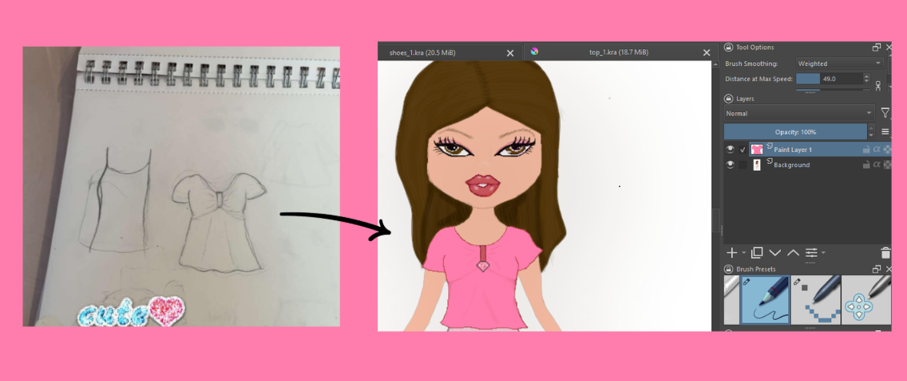

 **name:** DON dressup 🩷 
 **what is it:** a dress up webbrowser game 
 **made with:** javacript (code), phaser (game engine), canva (buttons, signs), krita (clothing assets + model) 
 **lore:** made for our little cousin who loves fashion very much
 **more lore:** our cousin drew the clothing assets on paper, and we drew them digitally (or tried to) 

 example of our process:

 **try it out!**
 **prerequisites:**
- just a modern web browser
- a local dev server (vs code live server perhaps? or npx serve, up to you)

 **installation**
 clone the repo:
   git clone https://github.com/your-username/don-dress-up.git
    cd don-dress-up

 start a local server: 
   npx serve .

  open http://localhost:3000 on ur browser 

  dont sue us bratz this is only for educational use! pls 🩷

